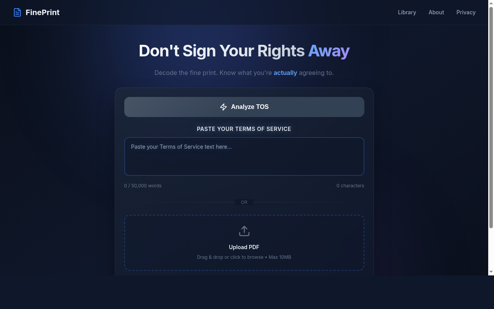

# FinePrint -- TOS Analyzer

AI-powered Terms of Service analyzer that transforms legal documents into clear, actionable risk assessments.

**Live:** [fine-print.org](https://fine-print.org)



## What It Does

Paste or upload any Terms of Service document and get an instant clause-by-clause risk analysis. Gemini AI categorizes every clause by severity (safe, concerning, or critical) across seven legal categories, then explains each one in plain English so you know exactly what you are agreeing to. Results include an overall risk score, key takeaways, and a public library of previously analyzed documents.

## Tech Stack

Next.js, TypeScript, Google Gemini 3.1 Pro, PostgreSQL (Prisma ORM), Redis (rate limiting + caching), Tailwind CSS, Zod

## Architecture

```
Browser --> Next.js API Routes --> Gemini AI --> PostgreSQL
                                |
                            Redis Cache
                       (dedup + rate limit)
```

Incoming text is normalized and SHA-256 hashed before hitting the AI. If the hash already exists in Redis or Postgres, the cached analysis is returned immediately -- no redundant API calls. Rate limiting uses atomic Lua scripts in Redis with a fail-closed policy: if Redis goes down, requests are blocked rather than allowed through. A daily token budget cap prevents runaway Gemini costs.

## Key Implementation Details

- **Content deduplication** -- SHA-256 hash of normalized text prevents redundant API calls
- **Fail-closed rate limiting** -- Atomic Lua scripts in Redis; blocks requests if Redis is down
- **Budget tracking** -- Daily token consumption limits to prevent runaway API costs
- **Prompt injection defense** -- Gemini systemInstruction API separates system prompt from user content; post-processing verifies all quoted text exists in the source document
- **7 risk categories** -- Privacy, Liability, Rights, Changes, Termination, Payment, AI & Data Use
- **Document validation** -- Rejects non-legal content before consuming API tokens

## Running Locally

```bash
git clone https://github.com/HeraclesBass/tos-analyzer.git
cd tos-analyzer
cp .env.example .env  # Add your Gemini API key, DATABASE_URL, REDIS_URL
npm install
npx prisma generate && npx prisma db push
npm run dev
```

Requires: Node.js 18+, PostgreSQL, Redis

## Tests

```bash
npm test           # 3 suites (API, Redis, utils)
npm run lint       # ESLint
```

## Project Structure

```
app/
  api/
    analyze/       Main analysis endpoint
    health/        Health check (DB + Redis + Gemini)
    library/       Public analysis library
    export/        PDF/JSON export
    upload/        PDF upload
    analysis/      View/publish shared analyses
  page.tsx         Upload interface
  library/         Browse published analyses
lib/
  utils.ts         Content hashing, validation, sanitization
  redis.ts         Cache, rate limiting, budget tracking
  services/
    gemini-analyzer.ts  AI analysis with structured output
components/        Risk badges, TOS cards, floating logos
__tests__/         Jest test suites
```

## License

MIT
